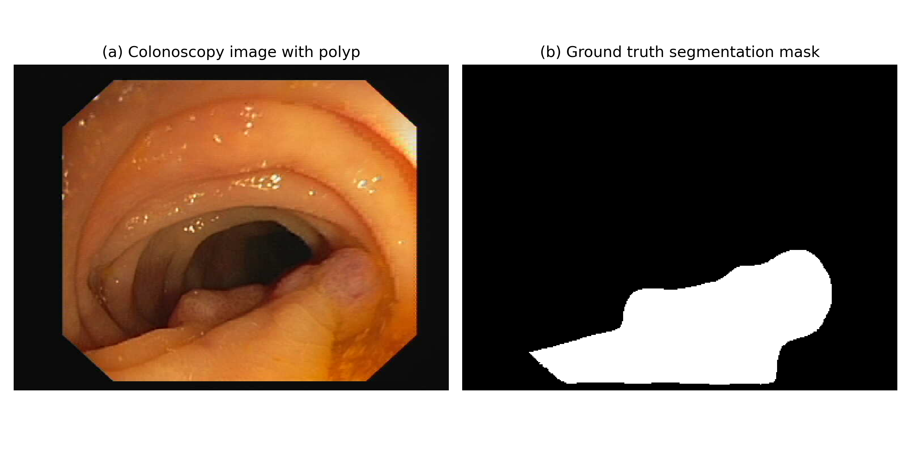
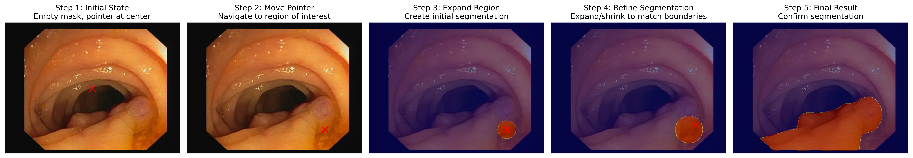

# BMI/CS 567 Final Project Proposal

**Title:** Reinforcement Learning for Interactive Polyp Segmentation in Colonoscopy Images
**Student:** Weibing Wang

*Figure 1: Example from CVC-ClinicDB dataset showing (a) a colonoscopy image with polyp and (b) its corresponding ground truth segmentation mask*

---

## 1. Problem

**Clinical Area and Motivation:**
The project focuses on colorectal cancer screening. Colonoscopy imaging is used to visually inspect the colon and identify polyps, which are early indicators of cancer. Accurate and efficient segmentation of polyps in colonoscopy frames can help automate and enhance early cancer diagnosis.

**Imaging Modality and Observed Region:**
The modality is RGB colonoscopy video frames, and the region of interest is the gastrointestinal tract—specifically, regions where polyps appear.

**Need for Image Analysis:**
Manual annotation of polyps is time-consuming and requires domain expertise. Image analysis enables scalable automation. Traditional segmentation approaches (e.g., U-Net) are effective but may lack flexibility for hard cases. This motivates the use of reinforcement learning to simulate interactive, human-like segmentation strategies.

---

## 2. Dataset

**Format and Annotation:**
Each sample includes a `.tiff` RGB image and a binary mask of the polyp in the same size and naming format. Masks are pixel-level annotations.

**Quantitative Description:**
CVC-ClinicDB includes 612 images in total. 330 images are labeled with polyp masks. The rest are frames with no polyps (can be used as negative examples if needed).

**Dataset Subset:**
We will use all labeled images (330) for supervised evaluation. A smaller subset (e.g., 200) may be used during early-stage RL exploration due to computational cost.

**Data Splits:**
We plan to use 70% of the labeled data for training, 15% for validation, and 15% for testing. A fixed random seed will be used to ensure reproducibility.

---

## 3. Proposed Analysis

**Project Goal and Solution Design:**We aim to train an RL agent to perform pixel-wise segmentation by interacting with an image—taking actions such as expanding/contracting the current segmentation mask or pointing to likely polyp regions. The pipeline includes:

- Initial mask state (empty mask)
- State encoding using CNN features
- Action space: move pointer, expand region, shrink region, confirm segmentation
- Reward: based on Dice similarity improvement relative to ground truth

*Figure 2: Illustration of the proposed RL-based interactive segmentation process. The agent starts with an empty mask, navigates to regions of interest, expands and refines the segmentation, and finally confirms the result.*

**Baseline Analysis:**
We will compare against U-Net trained on the same dataset. Metrics such as Dice and IoU will be compared to evaluate performance gains or tradeoffs with RL.

---

## 4. Evaluation Strategy

**Evaluation Metrics:**

- Dice Similarity Coefficient (DSC)
- Intersection over Union (IoU)
- Mean agent steps per image
- Convergence rate of policy learning

Results from RL will be benchmarked against the U-Net baseline. We will visualize the progression of the RL agent's segmentation process to analyze its behavior patterns and decision-making strategies.

---

## 5. Implementation Plan

**Environment Setup:**

- Python 3.8+
- PyTorch for deep learning components
- Gym for RL environment
- Stable-Baselines3 for RL algorithms (PPO)

**Project Timeline:**

1. Week 1: Data preprocessing and U-Net baseline implementation
2. Week 2: Design and implementation of RL environment
3. Week 3: RL agent training and hyperparameter tuning
4. Week 4: Evaluation, comparison, and visualization
5. Week 5: Final report preparation and code documentation

**Expected Challenges:**

- Balancing exploration/exploitation in RL training
- Designing an effective reward function
- Handling the large state space of image data
- Ensuring computational efficiency during training

---

## 6. Project Deliverables

1. GitHub repository with code implementation, including:

   - Data loading and preprocessing utilities
   - U-Net baseline implementation
   - RL environment for interactive segmentation
   - PPO agent implementation
   - Evaluation scripts
2. Trained models:

   - U-Net baseline model
   - PPO agent for interactive segmentation
3. Results and visualizations:

   - Comparative analysis of U-Net vs. RL
   - Visualizations of the RL agent's segmentation process
   - Performance metrics and analysis
4. Final report documenting the approach, results, and findings

---

The project will explore the novel application of reinforcement learning to simulate interactive segmentation processes that mimic how medical experts might approach the polyp segmentation task. This approach has the potential to offer more flexibility and interpretability compared to fully automatic segmentation methods.
