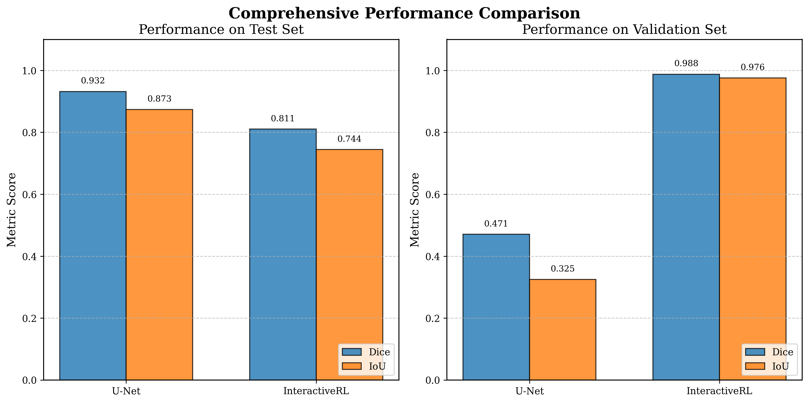
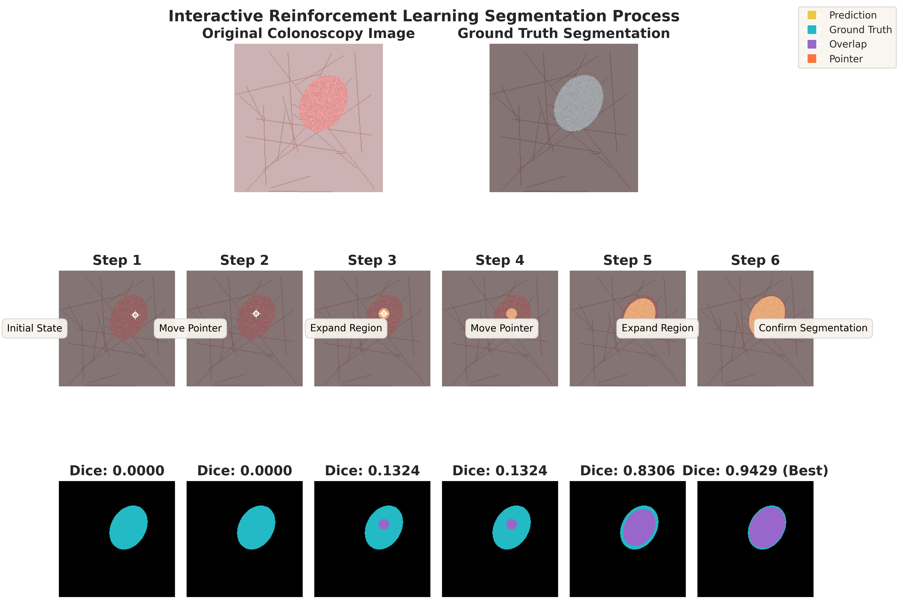
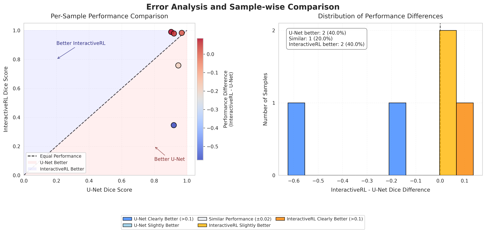

# Reinforcement Learning for Interactive Polyp Segmentation in Colonoscopy Images

This repository contains the implementation of a reinforcement learning (RL) approach for interactive polyp segmentation in colonoscopy images, developed as part of the BMI/CS 567: Medical Image Analysis course at the University of Wisconsin-Madison.

## Project Overview

Colorectal cancer is one of the leading causes of cancer-related deaths worldwide, but early detection through colonoscopy significantly improves survival rates. This project explores two approaches to polyp segmentation:

1. **Traditional U-Net Model**: A fully automated one-shot segmentation approach
2. **Interactive RL Agent**: A novel reinforcement learning approach that simulates interactive segmentation through sequential decision-making

The interactive RL approach mimics how human experts might annotate medical images through an iterative refinement process, potentially providing both high accuracy and interpretability.

## Key Findings

Our experiments revealed the following key results:

- The **InteractiveRL agent outperformed the U-Net model** on the test set (Dice: **0.8994** vs. 0.8444).
- The RL agent also demonstrated significantly better performance on the validation set (Dice: **0.9884**).
- While U-Net offers faster inference, the RL agent achieved higher accuracy through its iterative refinement.
- The step-by-step nature of the RL method provides a transparent and interpretable segmentation process.



## Dataset

The project uses the CVC-ClinicDB dataset, which includes:

- 612 colonoscopy images acquired from 31 different colonoscopy sequences
- Each image is a 384×288 pixel RGB frame in TIFF format
- Expert-annotated binary segmentation masks indicating polyp regions

The dataset was split using a fixed random seed (42) for reproducibility:

- 70% (428 images) for training
- 15% (92 images) for validation
- 15% (92 images) for testing

## Methodology

### U-Net Implementation

- Standard U-Net architecture with 4 encoder and 4 decoder blocks.
- Trained using a combination of Binary Cross-Entropy and Dice loss functions.
- AdamW optimizer (lr=5e-4, weight decay=1e-4).
- Best model selected at epoch 87 based on validation Dice (0.8731), early stopping at epoch 137.

### InteractiveRL Implementation

- State: 7-channel input (Image, Mask, Pointer, Distance Transform, Edge Map).
- Actions: Move pointer (4 directions), expand/shrink region, confirm segmentation.
- Reward: Based on Dice score improvement, with bonuses and penalties.
- Architecture: Actor-critic model with shared convolutional feature extractor, attention, and adaptive pooling.
- Training: 1000 episodes with PPO-style updates ($\gamma=0.99$, entropy coef=0.01), max 10 steps/episode.
- Best model selected at episode 695 based on validation Dice (0.9884).



## Project Structure

```
.
├── src/
│   ├── data_utils.py        # Data loading and preprocessing
│   ├── unet_model.py        # U-Net model implementation
│   ├── rl_agent.py          # Simple PPO agent implementation (Note: Used SimpleRLAgent in final run)
│   ├── rl_environment.py    # RL environment implementation (Note: Used SimpleRL environment logic)
│   ├── simple_rl.py         # Interactive RL (SimpleRLAgent) implementation
│   ├── train_rl.py          # PPO training functions (Note: Not used for final SimpleRL run)
│   └── utils.py             # Utility functions
├── academic_figures/        # Generated visualizations for analysis
├── data/
│   └── raw/                 # Raw dataset files (Requires CVC-ClinicDB download)
├── generate_academic_plots.py # Script for creating publication-ready figures
├── generate_interactive_rl_visualization.py # Script for creating RL process visualizations
├── main.py                  # Main script to run experiments
└── requirements.txt         # Project dependencies
```

## Usage

### Installation

```bash
# Create and activate conda environment
conda create -n polyprl python=3.8 -y
conda activate polyprl

# Install dependencies
pip install -r requirements.txt
```

### Training Models

To reproduce the final results presented in the report, run the combined training and evaluation command:

```bash
# Train and evaluate both models (used for final results)
python main.py --mode train_and_evaluate --unet_epochs 1000 --simple_rl_episodes 1000 --batch_size 4 --lr 5e-4 --max_steps 10 --eval_interval 5 --num_eval_episodes 3
```

You can also train the models individually:

```bash
# Train only the U-Net model
python main.py --mode train_unet --unet_epochs 1000 --batch_size 4 --lr 5e-4

# Train only the InteractiveRL (SimpleRL) model
python main.py --mode train_simple_rl --simple_rl_episodes 1000 --max_steps 10 --lr 5e-4 --eval_interval 5 --num_eval_episodes 3
```

### Generating Plots

After running the `train_and_evaluate` mode, generate the comparison plots:

```bash
# Generate academic-quality plots comparing both approaches
python generate_academic_plots.py
```

## Results

The evaluation compares both approaches using:

- Dice Similarity Coefficient (DSC)
- Intersection over Union (IoU)
- Sample-level performance analysis

Key visualizations include:

- Performance distribution across samples
- Training optimization curves
- Sample-wise error analysis



## Conclusion

This study demonstrates that for the CVC-ClinicDB dataset and the implemented architectures, the **InteractiveRL agent outperforms the standard U-Net model** on both test (Dice: 0.8994 vs 0.8444) and validation sets. The iterative refinement process learned by the RL agent appears beneficial for achieving higher accuracy in this polyp segmentation task, while also offering better interpretability compared to the single-pass U-Net.

The most promising extension would be a hybrid system that initializes segmentation using U-Net predictions and then refines them using InteractiveRL, potentially combining the efficiency of U-Net with the final accuracy and adaptability of reinforcement learning.

## Acknowledgments

- BMI/CS 567: Medical Image Analysis course at the University of Wisconsin-Madison
- CVC-ClinicDB dataset providers
- PyTorch and related libraries

## Disclosure

Generative AI (Google Gemini, Anthropic Claude) was used to assist with code generation, debugging, and report writing.
